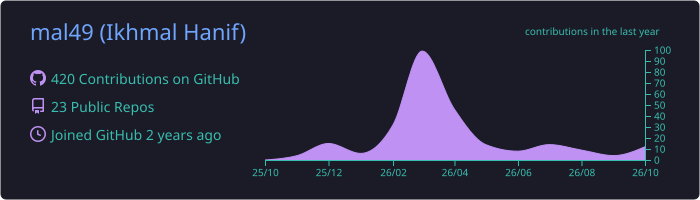
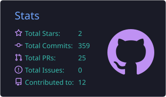
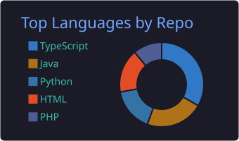
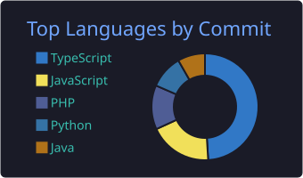
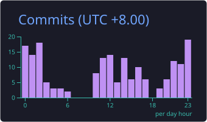

  

 

  
  
  

 

  
  
  
  

---

## 💫 About Me

- 🎓 Final-year **Computer Science (Honours)** at **UiTM Shah Alam**
- 💼 **IT Executive** by day, freelance work under **Nekolabs**
- 📸 Building **Memoroll**, a photobooth SaaS for Malaysian event operators
- 🏸 FYP: predicting badminton match outcomes with supervised ML (Decision Tree, Random Forest, XGBoost)
- 🚩 CTF player, **2nd Runner-Up at Flag Hunt 2025**
- 📫 Open to freelance collaborations

## 🛠 Tech Stack

**Frontend**

  
  
  
  
  
  

**Backend & Cloud**

  
  
  
  
  
  

**Data & ML**

  
  
  
  

## 📊 GitHub Stats

  
  

  

## 💻 Languages

  
  

## ⏰ Productive Time

  

 

